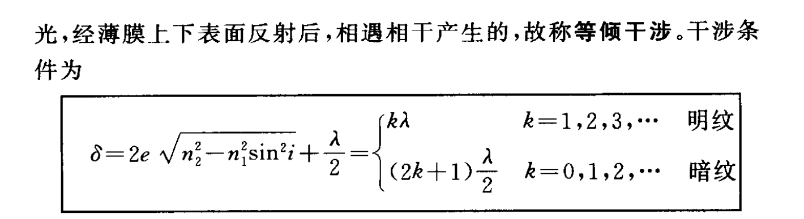
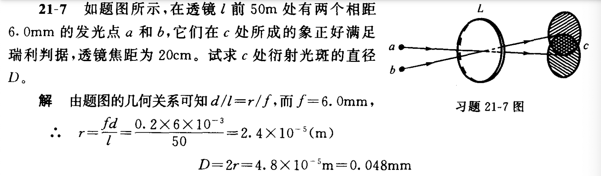

# 大学物理乙

## 静电场

### 电势

---

---

---

---

---

### 静电平衡

- （5）**球壳接地是一个完备的静电屏蔽系统**，内部带电体相当于不存在、不受力；或者理解成外表面的+q2都跑路了，然后外表面就变成了个干净球壳，于是又复刻了（4）的情况  

---

- （6）在（5）的基础上，这个系统已经平衡，此时拔不拔线都是**一样**的；此时再移去B球，那么壳**内部肯定是场强为0**，内表面负电荷-q2都跑到外表面，于是得到-q'-q2

----

- 先用电荷守恒，然后在对表面A，B点进行分析

----

  

- 先用**静电感应**，分析**内外表面**各自的带电量，然后再代入电势公式

---

### 电容

|类型|场强|电容|
|---|---|----|
|平行板电容器|$E=\frac{\sigma}{\epsilon_0}$|$C=\frac{\epsilon_0S}{d}$|
|单个球壳|$E=\frac{\sigma}{\epsilon}$|$C=\frac{\sigma\cdot 4\pi r^2}{E}=4\pi r^2 \epsilon$|
|两个球壳间|$E=\frac{q}{4\pi\epsilon_0r^2}$|$U=\int_{R_A}^{R_B}Edr=\frac{q}{4\pi\epsilon_0}(\frac{1}{R_A}-\frac{1}{R_B})$ -> $C=\frac{q}{U}$|
|圆柱|$E=\frac{\lambda}{2\pi \epsilon_0 r}$|$U=\int_{R_A}^{R_B}Edr=\frac{\lambda}{2\pi\epsilon_0}ln\frac{R_B}{R_A}$ -> $C=\frac{q}{U}$|

  

- 第二小问，我们取同一θ角的圆环，这样环上的束缚电荷面密度相同，然后求出一个环对球心的场强，最后再积分得到整体

---

--

- 利用前面那道题的场强结论，直接得到极化电荷的E'，然后代入电极化强度

### 介质中的高斯定理&电位移矢量

$D = \epsilon_0\epsilon_r E=\epsilon E$
$P=D-\epsilon_0 E$

|两种高斯定理|公式|
|---|----|
|真空|$\oint E\cdot dS=\frac{1}{\epsilon_0}\Sigma q$|
|电介质|$\oint D\cdot dS=\Sigma q$|

!!! info
    涉及电介质就采用D和对应高斯定理，真空中就采用E和对应高斯定理
    
    

- 原理还是利用高斯定理，尝试去求出q'  

---

### 静电能

#### 点电荷

- 点电荷系统的静电能，两两之间计算再相加，$W = \frac{1}{2}\sum_{i=1}^n q_iU_i$

- U是电势

#### 电荷连续分布（面/体）

- 还是运用上面的公式，之前是给定的$n$，现在变成了微元 -> 体/面

- $dq$ 再用体密度或者面密度代换为$\rho dV 或 \sigma dS$

- U是电势

#### 电容器的静电能

- 利用$W = Uq$ 推出每个微元$dq$的功，得到$dA = (U_A-U_B)dq = \frac{q}{C}dq$

- 再从0积分到Q

- $A = \frac{1}{2}\frac{Q^2}{C} = \frac{1}{2}CU^2$

#### 静电场的能量

- 把静电场看作匀强电场，然后电容就是等效于**对应电容器（平行板，球）**的电容

- $U = Ed$, $C = \epsilon \frac{S}{d}$, $W = \frac{1}{2}CU^2$

- 然后引入电场能量密度（单位体积）

- 常用 $w_e=\frac{1}{2}DE$

-----

!!! note "球体的静电能"
    - 计算均匀带电**球体**的静电能，设球的半径为R，所带电量为q，球外为真空。

    ??? note "答案"
    - 先明确思路，用带体密度的静电场公式计算  

    - 然后$\rho$是易知的，下面就要计算电势U

    - 要计算球的各处的电势，就要知道电场分布，就用**高斯定理来求电场**

    - 然后用积分来求出电势（分球壳内、球壳外两段）

    - 最后代入静电能公式，进行积分
    
    
    
    

!!! note "通过静电能来分析电场力"
    

    ??? note "答案"
        - 通过静电能来分析电场力 -> 虽然不懂，但是记住
        
        - 这是个电容器，所以要求静电能的话，我们在已知Q的情况下，只需要求C就行了

        - 然后根据插入的位置不同，整个电容器的C是不同的，然后这还是一个**并联**的电容器，所以可以直接把左右两部分相加

        - 最后求出静电能 W关于x的函数，求导取负便是电场力的函数

        
        
        

!!! note "电介质中利用D、E求能量密度，再求静电能"
    
    

## 稳恒电流

- 载流子里特殊的类型：电子空穴对 -> **半导体P型（空穴）带正电**，**N型（电子）带负电**，在**霍尔效应**中会考察

- $I = \frac{dq}{dt}$是电流强度

- 电流在导体内部分布可能是不均匀的，再进行微观细分，引入电流密度$j = \frac{dI}{dS}$ （取**垂直于电流方向的面**）

- 和电子数的关系

## 磁场

### 洛伦兹力

- $F = qv \times B$，同高中

### 毕奥-萨伐尔定律

- $dB = \frac{\mu_0}{4\pi}\frac{Idlsin\theta}{r^2}$

#### 直导线的磁场

- 利用角度的一个积分

- 直接上结论，a是垂直距离

$$
B = \frac{\mu_0 I}{4\pi a}(cos\theta_1 - cos\theta_2)
$$

#### 载流圆线圈轴线上的磁场

!!! abstact
    $B=\frac{\mu_0 I R^2}{2(R^2+x^2)^{3/2}}$

- 先取微分，得到 $dB = \frac{\mu_0 Idl}{4 \pi r^2}$

- 然后这个dB还会分在垂直方向和水平方向上，垂直方向上的dB最后互相抵消了，剩下了水平方向上

- 最后进行一个积分

!!! tip "特殊地："
    - 圆心处
    
    $$
    B = \frac{\mu_0 I \theta}{4 \pi R}
    $$

    - 在轴线上远离圆线圈时

    $$
    B = \frac{\mu_0IR^2}{2x^3} = \frac{\mu_0IS}{2\pi x^3}
    $$

-----

!!! tip "利用二级结论后，继续微元积分的题目"
    - 第一步的dB微元，是因为这相当于一个电流大小为dI的无线长导线在P处产生的磁场

    - 复习：直导线$B=\frac{\mu_0I}{4\pi a}(cos\theta_1-cos\theta_2)$

    
    

####  磁偶极子的磁矩

- 引入磁矩$p_m$来描述载流线圈的磁性质

- $\vec{p_m}=NIS\vec{n}$，n是个单位矢量，n的方向与电流环绕方向呈右手螺旋关系；引入这个量其实就是后面方便表示电生磁的一些东西

- 于是在上一小节中得到的，有关载流圆线圈在轴线上远离线圈的磁场 $B = \frac{\mu_0IS}{2\pi x^3} = \frac{\mu_0p_m}{2\pi x^3}$

#### 载流直螺线管内部的磁场

- 螺线管可以看做是很多个载流圆线圈组成

- 于是我们在螺线管上取$dl$，相当于电流强度$Indl$的圆电流，$n$是单位长度上的匝数

- $dB = \frac{\mu_0IndlR^2}{2(R^2+l^2)^{3/2}}$

- 然后从引入角度量$\beta$，然后神奇地转化掉了很多量，得到最终微分$dB = -\frac{\mu_0}{2}Insin\beta d\beta$

- 最后从$\beta_1$积分到$\beta_2$，得到$B = \frac{\mu_0}{2}In(cos\beta_2 - cos\beta_1)$

----

### 磁场的高斯定理

!!! info "概念"
    - 磁通量 $d\Phi = Bcos\theta dS$

!!! note "磁场中的高斯定理"
    - 闭合曲面内的磁通量为0

    $$
    \oint B\cdot dS = 0 \\
    此处为闭合曲面积分，只是latex暂时打不出来
    $$

!!! tip "同一平面内**矩形框内的磁通量**的简单积分"
    - 求出距离r时的，dr宽度的矩形内的磁通量大小，然后再对距离积分

    
    

----

### 安培环路定理

!!! info
    
    $$
    \oint_L B\cdot dl = \mu_0 \Sigma I
    $$

    - 在磁场中，沿任何**闭合曲线**，B矢量的线积分（或B矢量的环流），等于$\mu_0$乘以穿过这个闭合曲线为边界所张任意**曲面的各恒定电流的代数和**。

    - $L$的**环绕方向**的**右手定律**方向，为$I$的正向

 
#### 长直圆柱形载流导线内外的磁场

- 环路定理左边$\oint B\cdot dl = B\cdot 2\pi r$

- 然后分为三种情况

=== "当r > R"
    - 这种情况最简单，直接右边就是$\mu_0I$

    - 即$B = \frac{\mu_0I}{2\pi r}$

=== "当r < R且电流分布在导体表面"
    - 那么取得内部曲面也就没有电流，安培定理右边为0，B也就是0

=== "当r < R且电流均匀分布在导体的**截面**上"
    - 那么其实就是涉及到面密度了

    - 实际的I为$I\cdot \frac{\pi r^2}{\pi R^2}$

    - 所得磁场强度$B = \frac{\mu_0 I r}{2\pi R^2}$

----

-----

#### 载流螺旋环内的磁场

- 把一个载流螺旋管首尾相连，就得到了这么一个载流螺旋环；这里面有N个同心圆，r1是中心到圆内端的距离，r2是中心到圆外端的距离

- 于是，对于其中的一个点P，由环路定理可以得到$B\cdot 2\pi r = \mu_0NI$，即$B=\frac{\mu_0NI}{2\pi r}$

!!! tip "当r2-r1远小于r时"
    - 令$l=2\pi r$，则$B=\frac{\mu_0NI}{l}=\mu_0nI$

---

#### 载流长直螺线管内的磁场

---

### 磁场对电流的作用

#### 安培力

- $F=BILsin\theta$

!!! tip "平行长直载流导线间的相互作用力"
    - 相距为d的无限长直导线，电流分别为$I_1$，$I_2$

    - 那么他们产生的磁场大小作用在对方时 分别为$B_{12}=\frac{\mu_0I_1}{2\pi d}$，$B_{21}=\frac{\mu_0I_2}{2\pi d}$

    - 于是有导线2上的电流元受力$dF_{21} = B_{12}I_2dl \cdot sin(90°)$

---

#### 磁场对平面载流线圈的作用

- 我们容易发现作用在AD和BC上的安培力大小相等，方向相反，相互抵消；

- 但是对于在CD和AB上的力，$F_2=F_2'=BIl_2$；这两个力大小相等，方向相反，但是**不在同一直线上**，形成一**力偶**，力臂$l_1cos\theta$

- 力偶矩为:$M=F_2l_1cos\theta=BIl1l2cos\theta=BIScos\theta$

- 然后闲着蛋疼，非要拿磁矩表示

- $p_m = NIS$得到$\vec{M}=\vec{p_m}\times \vec{B}$

---

### 带电粒子在磁场中的运动

- 把带电粒子在磁场中的速度分解为两部分，一部分平行磁场，一部分垂直磁场

- 平行的部分匀速运动，垂直的速度导致作匀速圆周运动，二者叠加得到螺旋线

- $R = \frac{mv_{0n}}{qB}$

- 螺距$h=v_{0x}T = v_{0x}\frac{2\pi m}{qB}$

----

#### 质谱仪

- $qvB=qE, v=\frac{E}{B}$，速度是一定的

- 进入感应区，做圆周运动 $R=\frac{mv}{qB'}$ 便能得出质荷比

#### 回旋加速器

- 一直在缝隙间加速，最后最大动能和回旋半径有关 $E_k=\frac{1}{2}mv^2=\frac{1}{2m}q^2B^2R^2$

#### 同步回旋加速器

- 由于速度接近光速时，质量发生改变，那么运动时间会发生变化

- 最后就需要调整电压变化的频率

#### 霍耳效应

- 实验结果表明，霍尔电势差与I、B成正比，与厚度d成反比

- $d$是$B$**穿过**的部分的厚度

- $U = V_1-V_2 = R_H\frac{IB}{d}$，$R_H$被称为霍尔系数

!!! warning "正负电荷的霍尔系数不同"
    - 对于负电荷（电子）：$R_H=-\frac{1}{ne}$，$n$是单位体积内的电子数量
    
    - 对于正电荷：$R_H=\frac{1}{nq}$

----

## 磁场中的磁介质

### 磁介质的分类

- 磁场中放一个介质，介质内的磁感应强度$B$为原来真空中的磁感应强度$B_0$和附加磁感应强度$B'$之和

- $B=B_0+B'$

- 分为三类

- 顺磁质：$B > B_0$ 抗磁质：$B < B_0$ 铁磁质：$B >> B_0$

---

### 顺磁质合抗磁质的磁化

- 深入到原子层面

- 电子绕核运动的回旋周期为：$T=\frac{2\pi r}{v}$

- **等效电流**为：$I=dq/dt=e/T=\frac{ve}{2\pi r}$

- 又引入类似于载流线圈中的磁矩，轨道磁矩$\mu = IS=\frac{1}{2}ver$

- 同时，电子有做轨道运动的角动量$\vec{L}=\vec{r}\times\vec{p}=mvr\vec{n}$

- 又电子的角动量与磁矩反向，最终得到$\vec{\mu}=-\frac{e}{2m}\vec{L}$

---

### 磁化强度

!!! note "概念"
    - 磁化强度：介质磁化后**单位体积**内**分子磁矩的矢量和**

    - $M=\Sigma p_m/\delta V$

- 电流强度只在介质表面分布

- 在磁介质中截取长为$l$的圆柱体，若单位长度上的磁化电流线密度为$j_m$，则$ΔI_m=j_ml$，该介质段内总分子磁矩应等于磁化电流产生的磁矩，

- 最后代入M，神奇的事情发生：$|M|=\frac{|p_m|}{\delta V}=\frac{j_mls}{ls}=j_m$

- 这个就好似电场中，$P=\sigma$

- 同时磁化强度还有神奇的**环路定理**

- $\oint_L M\cdot dl = \Sigma I_m$

---

### 磁场强度、磁介质中的安培环路定理

- 由$\oint_L B\cdot dl = \mu_0(\Sigma I_0+\Sigma I_m)$

- 得到$\oint_L(\frac{B}{\mu_0}-M)\cdot dl = \Sigma I$

- 于是引入**磁场强度**$H=\frac{B}{\mu_0}-M$

- 最终得到磁介质中的安培环路定理$\oint_L H\cdot dl = \Sigma I$

!!! tip "磁介质中的磁场高斯定理"
    - $\oint_S B\cdot ds = \oint_S (B+B')\cdot ds = 0$

---

### B、M、H的关系

- $B = \mu_0H+\mu_0M$

- 同时，M实际上与H**成正比**，$M=\chi_mH$

- $\chi_m$称为磁化率，为无量纲量

- $\chi_m > 0$顺磁质，$\chi_m < 0$抗磁质，对铁磁质$\chi_m$很大且不是恒量

---

- $B=\mu_0(1+\chi_m)H$

- 然后我们又可以引入新的量$\mu_r=1+\chi_m$相对磁导率

- $B=\mu_0\mu_r H=\mu H$，$\mu$是磁导率

- 所以，$\mu,\mu_r,\chi_m$三者得其一即可知其二

!!! tip "对于真空来说"
    - $M=0,\chi_m=0,\mu_r=1,\mu=\mu_0$

---

- 磁场强度，是磁场的强度，和**介质无关**

!!! tip "Example"
    - 根据$B_0$先求出$H$

    - 然后就可以根据$H$得出另一介质中的$\mu_r$或者$B$

    

---

!!! warning "磁通量和匝数无关"
    

    - 磁场强度$H$用环路定理来求

    - 然后磁感应强度$B$用磁通量$\Phi$来求，$\Phi=BS$和$N$**无关**，有关的是后面**感生电动势**中

    - 最后$j_m=M=\frac{B}{\mu_0}-H$

---

## 电磁感应

### 楞次定律

!!! abstract
    闭合回路中产生**感应电流**的方向，总是使它所激发的磁场去**阻止原磁通量的变化**

### 法拉第电磁感应定律

- 回路中产生的感应电动势$\epsilon_i$，它正比于磁通量的时间变化率。

- $\epsilon_i = -\frac{d\Phi}{dt}=-\frac{d}{dt}\int_S B\cdot dS$

- 对于N匝线圈，总的感应电动势为：$\epsilon_i=-\frac{d}{dt}(\Sigma_{i=1}^N\Phi_i)=-\frac{d\Psi}{dt}$

- $\Psi = \Sigma\Phi$称为线圈的**全磁通**，每一**匝**线圈的磁通量**相等**时，$\Psi=N\Phi$称为线圈的**磁通匝链数**

---

!!! tip "感应电流和电荷"
    
    $$
    I_i=\frac{\epsilon_i}{R}=-\frac{N}{R}\cdot\frac{d\Phi}{dt}
    $$

    $$
    q = \int_{t_1}^{t_2}I_idt=-\frac{N}{R}\int_{\Phi_1}^{\Phi_2}d\Phi=\frac{N}{R}(\Phi_1-\Phi_2)
    $$

    - 感生**电荷**只与磁通量**变化量**有关，而与**快慢无关**

!!! note "Example--结合安培环路定理和电磁感应"
    

    - 先表示$B$，然后积分得到$\Phi$，最后对时间求导得电动势

    ??? note "答案"
        
    
---

#### 动生电动势

- 是由于导体棒在磁场中切割，微观电子移动形成了电场$E_k=F/m=v \times B$

- $\epsilon_i=\int_a^b(v\times B)\cdot dl = Bvl$

$$
d\epsilon_i=(v\times B)\cdot dl \\
\epsilon_i = \int d\epsilon_i = \int_L (v \times B)\cdot dl
$$

---

!!! abstract "计算动生电动势的步骤"
    1. 沿导线假定一个电动势的方向

    2. 取一个微元dl

    3. 根据微元dl的速度v和磁感应强度B，求$(v\times B)$

    4. 设$(v\times B)$与dl的夹角为β，得到动生电动势$d\epsilon_i = (vBsin\theta)dlcos\beta$

    5. 最后从a积分到b

    6. 如果$\epsilon_i$为正，则与实现假定的方向一直；若为负则相反

---

#### 感生电动势

$$
\epsilon_i = -\frac{d\Phi}{dt} = - \frac{d}{dt}\iint B\cdot dS = - \iint \frac{\partial B}{\partial t}\cdot dS
$$

- 不论空间有无导体存在，**变化的磁场**总是在其周围激发一种电场，这种电场具有涡旋性，称为**感生电场或涡旋电场**。

- 从场的观点看，涡旋电场可在任意有变化磁场的空间存在，而不依赖于是否有导体存在。

- 当有导体存在时，显示出感应电流。

- 感生电场是有旋场，与磁感应强度变化率的方向 相反

!!! abstract "计算导体上的感生电动势"
    - 第一种：用法拉第电磁感应定律

    - 第二种：如果磁场的分布有对称性，我们可以用上面的结论先求出$E_i$然后，在导体棒上积分即可$\epsilon_i=\oint_a^b E_i \cdot dl$

---

!!! tip "Example--涡旋电场的简单例子"
    
    ??? note "答案"
        

---

!!! tip "Example--涡旋电场中求感生电动势"
    

    ??? note "答案"
        
        
        

        - 法二尤其巧妙，将$\oint E_i \cdot dl = - \frac{d\Phi}{dt}$结合得紧密！！！

!!! tip "Example--综合"
    
    

---

### 自感与互感

#### 自感系数

- 这是针对于螺线管中发生的事情

$$
\begin{align}
B &= \frac{\mu_0NI}{l} \\
\Phi &= BS = \frac{\mu_0NI}{l}\pi R^2 \\
\Psi &= N\Phi = \frac{\mu_0N^2I}{l}\pi R^2 \\
\epsilon_L &= -\frac{d\Psi}{dt} = -\frac{\mu_0\pi N^2R^2}{l}\frac{dI}{dt}
\end{align}
$$

- $\epsilon_L = -\frac{d\Psi}{dt} = -L\frac{dI}{dt}$

- 因此得到自感系数 $L=\frac{d\Psi}{dI}$

- 自感系数（自感）定义为：**回路**中电流变化为单位值时，在回路本身所围面积内引起的全磁通的改变值。

!!! tip "Example"
    两根半径为a的平行长直传输线，相距为d(见图)，且a << d。试求长为l的这对传输线的自感。

    
    

### 磁场的能量

!!! abstract

    $$\begin{align}
    W_m &= \frac{1}{2}LI_0^2=\frac{1}{2}BHV\\
    \omega_m &= \frac{1}{2}B\cdot H
    \end{align}
    $$

!!! tip "Example--两种方式求自感"
    - 

    - 第一问能量的计算，直接套公式$\omega_m = \frac{1}{2}BH$；然后就积分$dW_m = \omega_m dV$

    - 第二问有两种方法：

        1. $L = \frac{d\Phi}{dI}$

        2. $W_m = \frac{1}{2}LI_0^2$

    ??? note "答案"
        
        

        - 另一种方法：

        
    
---

## 电磁场与电磁波

### 位移电流

- 环路定理**只适用于稳恒电流**，而在不稳定条件下，环路定理不适用。引起原因是传导电流不连续。在电容器充（放）电时，$I$ 在极板上被截断，但电荷量$q$及面密度$σ$随时间变化，期间的电位移$D$及电位移通量$\phi_D=SD$ 也随时间而改变。设电容器极板面积为$S$，电荷面密度$σ$，则充放电时：
    
$$
\begin{align}
I &= \frac{dq}{dt}=S\frac{d\sigma}{dt}=S\frac{dD}{dt}\\
\end{align}
$$

- $dD/dt$在充电时与电场方向一致，放电时与电场方向相反，但无论充放电都与电流方向一致。Maxwell提出：变化的电场也可以看作是一种电流——**位移电流**

$$
\begin{align}
j_d &= \frac{\partial D}{\partial t}\\
I_d &= \frac{d\Phi_d}{dt}
\end{align}
$$

- **电场中某点的位移电流密度等于该点电位移矢量的时间变化率。通过电场中某截面的位移电流等于通过该截面的电位移通量对时间的变化率。**

---

- 在充电电路中，我们引入**全电流**的概念

- $I_全=\Sigma I+I_d$

!!! abstract "非稳恒情况下的安培环路"
    $$
    \oint H\cdot dl = \Sigma I + I_d = \frac{d\Phi}{dt}
    $$

    - 凡是有随**时间变化**的电场，就会有位移电流

    - 其中对于平行板电容器，一般有$\Phi_D=DS=\sigma S=Q=CV, I_D=\frac{d\Phi_D}{dt}=C\frac{dV}{dt}$

### 电磁振荡

- 我们巧妙地发现了电磁振荡时$q$的振动方程，得到频率$\omega =1/\sqrt{LC}$

!!! tip "Example"
    

---

## 光的干涉

### 双缝干涉

- 亮纹：$x=\pm k\frac{D}{d}\lambda$

- 暗纹：$x=\pm (2k-1)\frac{D}{2d}\lambda$

!!! abstract "说明"
    1. 缝间距d愈小，干涉条纹间距Δx愈大，干涉明显。d大到一定程度，使得条纹间距小于0.1mm时，肉眼将观察不到干涉现象。

    2. λ愈大，则条纹间距大；复色光源做实验时，红光在外，紫光在内

    3. 要使条纹分得开，还需要D较大。

---

- 干涉条纹强度分布：

$$
\begin{align}
E_p^2 &= E_1^2+E_2^2+2E_1E_2cos\Delta\phi\\
E_p^2 &= 2E^2(1+cos\Delta\phi) = 4E^2cos^2\frac{\Delta\phi}{2}\\
I_p &= 4Icos^2\frac{\Delta\phi}{2}
\end{align}
$$

---

### 薄膜干涉

!!! tip "光程"
    - 设光在真空中的波长为$\lambda$，在媒介中波长为$\lambda_n$，光在介质中经过的路程为x

    $$
    \begin{align}
    折射率: n &= \frac{c}{u}\\
    \lambda_n &= uT = \frac{cT}{n}=\frac{\lambda}{n}\\
    \Delta\phi &= 2\pi \frac{x}{\lambda_n}=\frac{2\pi}{\lambda}nx
    \end{align}
    $$

    - 称$\delta=nx$为光程

- 若两相干光束（初相相同）通过不同介质，则在空间相遇时的相位差为:$\Delta\phi=\frac{2\pi}{\lambda}(n_2r_2-n_1r_1)$

- 可见相位差取决于光程差$\delta=n_2r_2-n_1r_1$

!!! tip "Example--小结论"
    
    

    - 对于例题2，光强的变化取决于相位差，相位差取决于光程差

    ??? note "答案"
        $\delta = (n-1)x$

        $I=I_0cos^2\frac{\Delta\phi}{2}=I_0cos^2\frac{(n-1)\pi x}{\lambda}$

        

---

- **光垂直照射薄膜时**：

!!! tip "Example--增透"
    - 增透：让进来的光线更多，出去的更少，则反射光要相消干涉

    

-------

- **当倾斜入射时（等倾干涉）：**

!!! tip "Example--反射"
    
    

    ---

    

### 等厚干涉

!!! abstract
    

    - 这决定了我们的**光程**！！！

!!! tip "另一种情况--测量小角度"
    

---

!!! tip "Example--测直径"
    
    

!!! tip "Example--根据条纹间距和厚度判断直径差"
    

!!! tip "Example--判断表面平整度！！"
        
    
    
    - 暗条纹先行到来，说明e是提前变大了，那么肯定是往下**凹**了

---

- **牛顿环：**

!!! tip "Example"
    
    

!!! tip "Example--带折射率、无半波损失的牛顿环"
    
---

## 光的衍射

### 单缝夫琅和费衍射

- 单缝夫琅和费衍射是平行光透过一条细长的矩形直缝后，在**很远的观察屏**上呈现的衍射现象

#### 菲涅尔半波法

- 光程差$\delta = BC = asin\theta$

!!! abstract
    

    !!! warning
        - 只有**单缝衍射的公式不同**

        - 我们会发现，这里的公式不同于以前的奇数倍相消、偶数倍相长；这里相消相长，主要是因为偶数倍平面的抵消了，奇数倍的才能相长

#### 单缝衍射图样的特征

!!! abstract 

    1. 条纹的亮度分布
        
        - 中央明纹的光强最大，随着k增加，波带数增多，未被抵消的波带面积变小，条纹光强减弱

    2. 中央明纹的半宽度$\Delta \theta$

        - 第一级暗纹的衍射角

        - $asin\theta_1 = \lambda, \Delta\theta = \theta_1=arcsin\frac{\lambda}{a} \approx \frac{\lambda}{a}$
    
    3. 色散效应

        - λ一定，a减小，θ增大；a不变，λ增大，θ增大

        
    
!!! tip "Example"
    
    
    

### 光栅衍射

- 透射光栅中，透光缝宽度为a，不透光部分为b，d=a+b为光栅常数；光栅狭缝数越多，衍射条纹越亮、越细锐

- 光栅衍射图像是由多个狭缝单缝衍射图像相互干涉形成的

!!! abstract "明暗纹"
    - 明纹：$dsin\theta=k\lambda$；称为光栅公式，k有上限$k<d/\lambda$

    ---

    - 暗纹：

    
    
    

    - 次极大：

    

    - 主极大缺级：光栅衍射图样是多个单缝衍射图象相互干涉形成的, 如果**单缝衍射暗纹出现的位置正好是光栅方程主极大的位置**, 就会发生主极大缺级

    
    

    - 原因就是在单缝衍射暗纹的位置，光强是0，所以干涉叠加后也还是0 

---

!!! tip "Example"
    

    - 第一问简单，算个d，然后k上限就是d/λ，然后再注意缺级

    - 第二问，斜入射就是光程差会多一部分dsinφ，不再单单是dsinθ

    ??? note "答案"
        
        
        

#### 光栅光谱与分辨

!!! warning "这个$\lambda$通常取平均数$\bar{\lambda}$，见下例"

!!! tip "Example"
    

    - 第一问，根据$R=\frac{\lambda}{\Delta\lambda}=KN$，算出N的范围

    - 第二问，根据衍射角来算d的范围

    - 第三问，缺级公式，显然能发现k1只能取1，算出具体的a和b

    ??? note "答案"
        
        

---

### 圆孔衍射

#### 瑞利判据

- 瑞利判据：**当爱里斑的边缘（即第一级暗环）正好落到另一个爱里斑的中心**

!!! abstract
    

---

!!! tip "Example"
       

     

## 光的偏振

- 只有横波具有偏振现象

### 偏振光和自然光

- 电磁波中E矢量始终沿某一方向振动，则是线偏振光

---

- 振动面在空间各个方向高速随机变化的光称为自然光。在x和y方向上的平均振幅相同；则是自然光

---

- 介于二者之间的偏振光称为部分偏振光

### 起偏和检偏

- 一般光源发出的光大多是非偏振光。获得偏振光的主要途径是设法将自然光变为偏振光，称为**起偏**。凡是能够将非偏振光变为偏振光的光学器件称为**偏振器**，或**起偏器**。用适当的偏振光学器件检验一束光是否偏振光称为**检偏**，这种光学器件称**检偏器**。

---

### 马吕斯定律

!!! tip "Example--马吕斯定律"
    

    - 自然光第一次变成偏振光时，光强减半；然后连用两次马吕斯定律

    ??? note "答案"
        
        
        

### 布儒斯特定律

- 自然光在两种介质n1,n2的交界面上发生反射和折射时, 反射光折射光都将成为**部分偏振光**。反射光中垂直入射面的光矢量相对加强, 折射光中平行入射面的光矢量相对加强。

### 光的双折射

- 一束光线进入方解石晶体后，分裂成两束光线，它们沿不同方向折射，这种现象称为双折射。

- 光线进入晶体后，分成两束，其中一束遵守折射定律，称为寻常光线（o光），另一束不遵守折射定律，称为异常光线（e光）。

---

!!! tip "波晶片"
    
    
    
    

---

!!! tip "椭圆偏振光"
    
    
    
    
    
    

## 量子光学

### 热辐射、黑体辐射

1. 单色辐射出射度（单色辐出度）

    - 单位时间，从单位表面积上发射的在$\lambda\sim d\lambda$范围内的辐射能为$dM_\lambda$

    - 代表单位时间、单位面积、单位波长间隔所发射的能量

$$
M_\lambda(T)=\frac{dM_\lambda}{d\lambda}
$$

2. 辐射出射度

    - 单位时间，单位面积上各种波长的总辐射能

$$
M(T)=\int_0^\infty M_\lambda(T)d\lambda
$$

3. 吸收系数，反射系数

    - 吸收系数：吸收的能量与入射总能量的比值

    - 反射系数：反射的能量与入射总能量的比值

    - 单色吸收、反射系数：$\alpha(\lambda,T),r(\lambda,T)$

- **黑体**：如果物体在热辐射过程中，任何温度下，**全部吸收**投射到其表面的各种波长的辐射能，既不反射也不透射，称为绝对黑体，简称黑体；$\alpha_B(\lambda,T)=1,r_B(\lambda,T)=0$

#### 基尔霍夫定律

- 各种不同的物体，在**同一温度**下，对任一波长的**单色辐出度与单色吸收系数的比值**都相等

$$
\frac{M_{1\lambda}(T)}{\alpha_1(\lambda,T)}=\frac{M_{2\lambda}(T)}{\alpha_2(\lambda,T)}=...=\frac{M_{B\lambda}(T)}{\alpha_B(\lambda,T)}
$$

- 因为绝对黑体的$\alpha_1(\lambda,T)=1$，上式可写成

$$
\frac{M_{\lambda}(T)}{\alpha(\lambda,T)}=M_{B\lambda}(T)
$$

#### 1. 斯忒藩-玻尔兹曼定律

- 每一条曲线下的面积代表一定温度下绝对黑体的辐射出射度$M_B(T)$

- 单位表面积所发射的功率：

$$
\begin{aligned}
M_B(T)=\int_0^\infty M_{B\lambda}(T)d\lambda=\sigma T^4\\
\sigma = 5.67\times 10^{-8}J\cdot s^{-1} \cdot m^{-2} \cdot K^{-4}
\end{aligned}
$$

#### 2. 维恩位移定律

- 每条曲线都有一个峰值，随着温度升高，峰值对应的波长$\lambda_m$越短，即峰值位置往**短波**方向移动；同时各种波长的**单色辐出度**都随**温度的升高而迅速增大**

$$
\lambda_m = \frac{b}{T}, b=2.898\time 10^{-3}\cdot K
$$

!!! tip "Example"
    测得太阳光的峰值波长为510nm，求太阳表面的温度及单位表面积所发射的功率。

    $T=\frac{b}{\lambda_m}=5682K$

    $M(T)=\sigma T^4 = 5.9\time 10^7 W\cdot m^{-2}$

### 光电效应

!!! tip "Example--能量量子化"
    

    - 第一问，求振子的能量，先求频率，再求能量

    ??? note "答案"
        
        

---

#### 1. 入射光强度问题

- **饱和**电流$i$，以及单位时间内从阴极C发射的光电子数，与入射光的**强度**$I$成**正比**

#### 2. 入射光频率问题

- 最大初动能和遏止电压的关系：

$$
E_{km}=\frac{1}{2}mv^2=e|U_a|
$$

- 遏制电势差$U_a$随入射光频率$\nu$呈线性增加；光子最大初动能和频率有关，与光强无关；k是与金属材料无关的普适恒量，**U0则取决于金属性质**

$$\begin{aligned}
U_a&=k\nu-U_0 \\
E_{km}&=e|U_a|=ek\nu-eU_0 
\end{aligned}
$$

$$
\frac{1}{2}mv_m^2=h\nu-W
$$

- 截止频率（红限）：$\nu_0=\frac{U_0}{k}$

---

#### 光电效应方程，光子能量、动量

$$
\begin{aligned}
E&=h\nu=\frac{1}{2}mv_m^2+A, A是逸出功
E&=h\nu=pc
p&=\frac{h\nu}{c}=\frac{h}{\lambda}
\end{aligned}
$$

- 特殊地，截止频率$h\nu_0 = A$

---

!!! tip "Exmaple--光电效应"
    

    - 第一问：初动能=光子能量-逸出功

    - 第二问：用逸出功算红限

    - 第三问：根据光强和光子能量来算数量

    ??? note "答案"
        

---

### 康普顿效应

然后结合动量守恒定律

$$\begin{aligned}
&x方向：\frac{h\nu_0}{c}=\frac{h\nu}{c}cos\phi + mVcos\theta \\
&y方向：\frac{h\nu}{c}sin\phi = mVsin\theta
\end{aligned}
$$

联立之后消去$\theta,V$得到

$$
\Delta\lambda = \lambda-\lambda_0 = \frac{h}{m_0c}(1-cos\phi)=\frac{2h}{m_0c}sin^2\frac{\phi}{2}
$$
    

- 然后针对电子的能量，就是动能，考虑相对论效应

$$
E_k = mc^2-m_0c^2 = \frac{m_0c^2}{\sqrt{1-(v/c)^2}}-m_0c^2
$$

## 量子力学

### 德布罗意波

- 实物粒子也有波动性，具有相应的频率$\nu$和波长$\lambda$

$$
\begin{aligned}
E &= mc^2 = h\nu \\
p &= mv = \frac{h}{\lambda} \\
\lambda &= \frac{h}{p} = \frac{h}{mv}, m = \frac{m_0}{\sqrt{1-v^2/c^2}}\\
若v << c: \lambda &= \frac{h}{m_0v}
\end{aligned}
$$

### 坐标和动量的不确定性关系

- 在经典力学中，运动物体具有完全确定的位置、动量、能量和角动量。对于微观粒子，虽然分别确定其位置或动量在精确度上并不存在限制，但在实验中同时确定其位置和动量时，它们的精确度是有限的。

- 微观粒子**位置**和**动量**两者不确定量之间的关系满足

$$\begin{aligned}
\Delta x \Delta p_x \geq \frac{\hbar}{2}, &\Delta y \Delta p_y \geq \frac{\hbar}{2}, \Delta z \Delta p_z \geq \frac{\hbar}{2}\\
&\hbar = h/2\pi 
\end{aligned}
$$

---

!!! tip "Example"
    
    
    

### 能量和时间的不确定性关系

$$
\Delta E \Delta t \geq \frac{\hbar}{2}
$$

- 用上述关系可以解释各原子激发态的能级宽度$\Delta E$与它在激发态的平均寿命$\Delta t$之间的关系。

### 波函数及其统计解释

!!! abstract 

    - $t$时刻，在空间某处(x,y,z)附近的无限小体积元$dV$内粒子出现的概率：

    $$
    dW = \Psi\Psi^*dV
    $$

!!! tip "Example"
    

### 一维无限深势阱

- 然后用薛定谔方程一通算，最后得到**定态波函数**

$$
\psi_n(x) = \sqrt{\frac{2}{n}}sin\frac{n\pi x}{a}
$$

## 原子的玻尔理论

24-1，24-3，24-5，24-7，24-10，24-11
